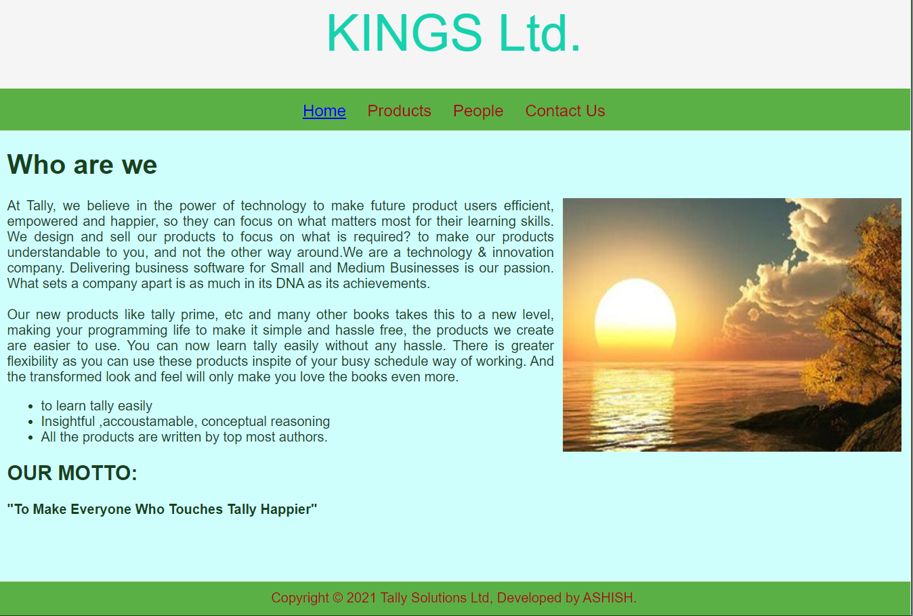
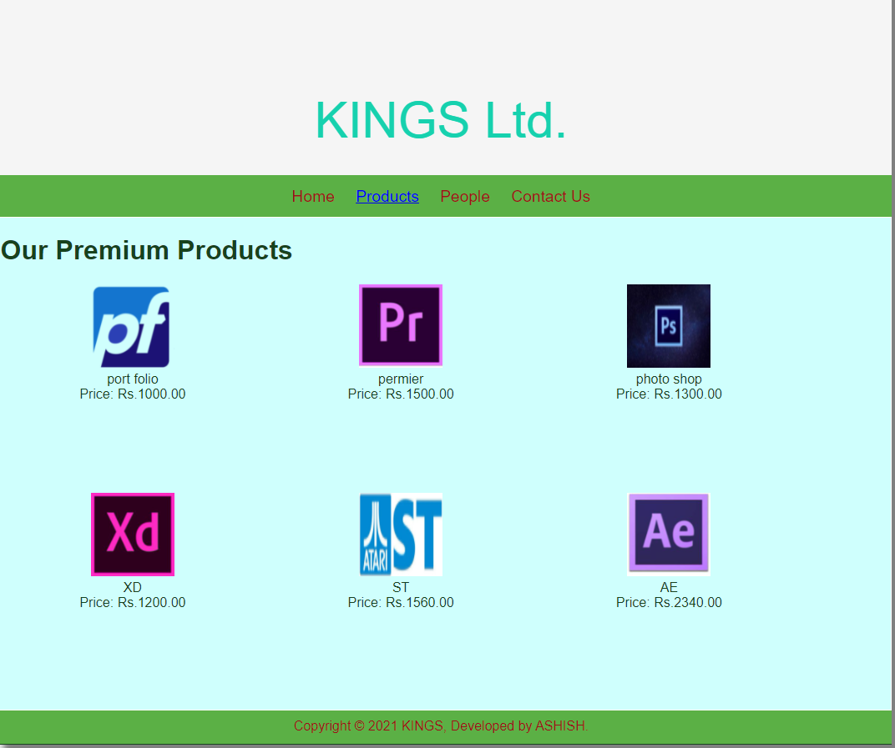
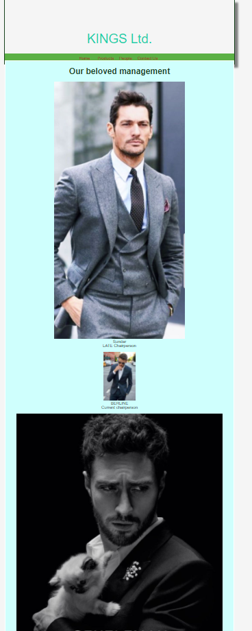

# Web Design for a Software Product Company

## AIM:

To design a static website for a software product company company.

## DESIGN STEPS:

### Step 1:

Requirement collection.

### Step 2:

Creating the layout using HTML and CSS.

### Step 3:

Updating the sample content.

### Step 4:

Choose the appropriate style and color scheme.

### Step 5:

Validate the layout in various browsers.

### Step 6:

Validate the HTML code.

### Step 6:

Publish the website in the given URL.

## PROGRAM :
### HOME PAGE:
<!DOCTYPE html>
<html lang="en">
  <head>
    <title>KINGS Ltd.</title>
    <link rel="stylesheet" href="./css/layout.css" />
    <link rel="icon" href="./img/icon.png" type="image/x-icon" />
  </head>

  <body>
    

      
KINGS Ltd.

      

        
<a href="/static/home.html">Home</a>

        
<a href="/static/products.html">Products</a>

        
<a href="/static/produts.html">People</a>

        
<a href="/static/Contact Us.html">Contact Us</a>

      

      

        

          <h1>Who are we</h1>
          
          

            At Tally, we believe in the power of technology to make future 
            product users efficient, empowered and happier, so they can focus on what
            matters most for their learning skills. We design and sell our
             products to focus on what is required? to make our products understandable to you,
              and not the other way around.We are a technology & innovation company. 
              Delivering business software for Small and Medium Businesses is our passion.
              What sets a company apart is as much in its DNA as its achievements. 
             
             
            Our new products like tally prime, etc and many other books
             takes this to a new level, making your programming life to make it
            simple and hassle free, the products we create are easier to use.
            You can now learn tally easily without any hassle.
            There is greater flexibility as you can use these products inspite of your busy schedule
            way of working. And the transformed look and feel will only make you
            love the books even more.
            <ul>
              <li>to learn tally  easily</li>
              <li>Insightful ,accoustamable, conceptual reasoning</li>
              <li>All the products are written by top most authors.</li>
            </ul>
            <h2>OUR MOTTO:</h2>
            <b>"To Make Everyone Who Touches Tally Happier"</b>
          

        

      

      

        Copyright &#169; 2021 KINGS, Developed by ASHISH.
      

    

  </body>
</html>

### peolpe:
<!DOCTYPE html>
<html lang="en">
  <head>
    <title>KINGS Ltd.</title>
    <link rel="stylesheet" href="./css/layout.css" />
    <link rel="icon" href="./img/icon.png" type="image/x-icon" />
  </head>
  <body>
    

      
KINGS Ltd.

      

        
<a href="/static/home.html">Home</a>

        

        
<a href="/static/products.html">Products</a>

        
<a href="/static/people.html">People</a>

        
<a href="/static/Contact Us.html">Contact Us</a>

      

      

        
    
          <h1>Our beloved management</h1>
          

              
 
                  

                  
                  

                  
Sundar 

                  
LATE Chairperson  

              

               
              
 
                  

                  
                  

                  
BERLINE

                  
Current chairperson 

              

               
              

                

                  
                

                
Bharat

                
CEO 

              

               
              

                

                  
                  

                  
Tejas 

                  
Managing director 

          

           
          

            

              
              

              
Ganesh.S

              
Chief Financial officer

      

       
          

            

              
              

              
ANODI

              
Chief Financial officer

      

          
        
      

      

        Copyright &#169; 2021 KINGS Ltd, Developed by ASHISH
      

    

  </body>
</html>

### products:
<!DOCTYPE html>
<html lang="en">
  <head>
    <title>KINGS Ltd.</title>
    <link rel="stylesheet" href="./css/layout.css" />
    <link rel="icon" href="./img/icon.png" type="image/x-icon" />
  </head>

  <body>
    

      
KINGS Ltd.

      

        
<a href="/static/home.html">Home</a>

        

          <a href="/static/products.html">Products</a>
        

        
<a>People</a>

        
<a>Contact Us</a>

      

      

        
    
          <h1>Our Premium Products</h1>
          

              
 
                  

                  
                  

                  
port folio

                  
Price: Rs.1000.00 

              

              
 
                  

                  
                  

                  
permier

                  
Price: Rs.1500.00 

              

              
 
                

                
                

                
photo shop

                
Price: Rs.1300.00 

            

            
 
              

              
              

              
XD

              
Price: Rs.1200.00 

          

          
 
            

            
            

            
ST

            
Price: Rs.1560.00 

        

        
 
          

          
          

          
AE

          
Price: Rs.2340.00 

      

          

          
        
      

      

        Copyright &#169; 2021 KINGS, Developed by ASHISH.
      

    

  </body>
</html>

### contact us:
<!DOCTYPE html>
<html lang="en">
  <head>
    <title>KINGS Ltd.</title>
    <link rel="stylesheet" href="./css/layout.css" />
    <link rel="icon" href="./img/j2.jpg" type="image/x-icon" />
  </head>

  <body>
    

      

      

        
<a href="/static/home.html">Home</a>

        
<a href="/static/products.html">Products</a>

        
<a href="/static/people.html">People</a>

        
<a href="/static/contactus.html">Contact Us</a>

      

      

        

          <h1>Contact Us:</h1>
          <h1>Address:</h1>
          

            13 ASHISH, PARAM COLONY,  BANGALORE, 240109, INDIA.
          
 
          <h1>Phone:</h1> 
          

              MR.SURANDAR(HR):9656325856  
              MR.BERLINE(Assistant HR):8956237412
          

          <h1>E-Mail:</h1>
          

              Sales:berline65@gmail.com
          

        

      

      

        Copyright &#169; 2021 KINGS Ltd., Developed by ASHISH
      

    

  </body>
</html>
## OUTPUT:

### Home Page:

## Result:

Thus a website is designed for the software product company and the HTML,CSS code are validated.
